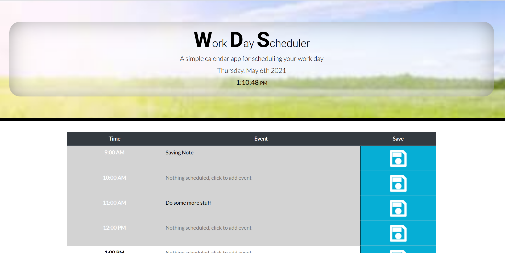
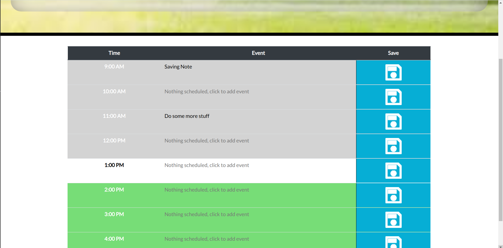
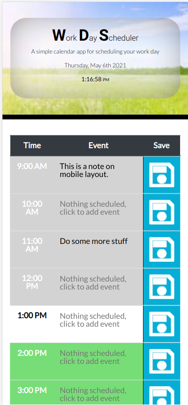

# Scheduler

## Application Summary

A simple calendar application that allows a user to save events for each hour of the day. This app will run in the browser and feature dynamically updated HTML and CSS powered by jQuery.

## Links and Screenshots

### Link to live application deployment information

[Scheduler Live Deployment](https://proto133.github.io/Scheduler/)

---

 

---

## Usage 

Usage is relatively intuitive. 

1. Simply click on the appropriate cell in the event column.
2. Type your event note.
3. Click Save.
4. That's it! You'll notes will still be there when you come back.

## Works Cited

<a href="https://fonts.google.com">Google Fonts</a>